# Vertigo Data Analyst Case Study - 2025

## Overview

This repository contains a comprehensive data analysis case study focusing on A/B testing analysis and user behavior exploration for a mobile game. The analysis is divided into two main tasks:

- **Task 1**: A/B Test Analysis - Comparing two variants (A and B) across multiple scenarios
- **Task 2**: Exploratory Data Analysis - Deep dive into user characteristics and engagement patterns

---

## Purpose of Analysis

**Task 1**: Determine which variant (A or B) performs better across DAU, revenue, and various business scenarios.

**Task 2**: Uncover insights about user characteristics, engagement patterns, and monetization behaviors through exploratory data analysis.

---

## Methodology

### Task 1
- **Retention Modeling**: Power Law curve fitting (`Retention = a * t^b`) using `scipy.optimize.curve_fit`
- **DAU Calculation**: Cohort-based approach tracking retention over time
- **Revenue Calculation**: IAP Revenue + Ad Revenue (eCPM-based)
- **Scenarios**: Baseline, Sale campaign, New user source, Prioritization analysis

### Task 2
- **Data Preprocessing**: Load compressed CSV files, calculate derived features (days_since_install, avg_session_duration, win_rate, total_revenue)
- **Segmentation**: First-day engagement tiers (Low/Medium/High) based on percentiles
- **Trend Analysis**: Daily trends and lifetime trends (by days since install)

---

## Assumptions

### Task 1
1. Both variants receive 20,000 new users per day (unless specified)
2. Power Law model accurately represents retention between measured points
3. Purchase ratio remains constant unless modified by scenarios
4. Average purchase amount: $1.00
5. New user source uses exponential retention formulas

### Task 2
1. Provided data is accurate and complete
2. Daily snapshots represent actual user activity
3. 33rd and 66th percentiles provide meaningful segmentation

---

## Key Findings

### Task 1 - Results

#### Task 1a: DAU Comparison (Day 15)
**Winner: Variant B**
- Variant B: 56,474 DAU
- Variant A: 54,685 DAU
- Variant B has 3.27% higher DAU

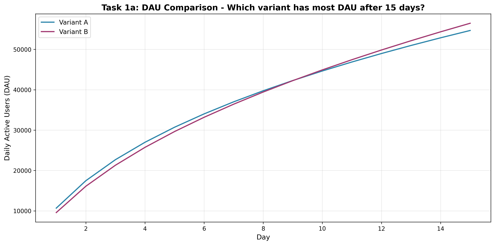

#### Task 1b: Revenue Comparison (Day 15)
**Winner: Variant A**
- Variant A: $29,737.09
- Variant B: $27,261.33
- Variant A generates 9.08% more revenue despite lower DAU

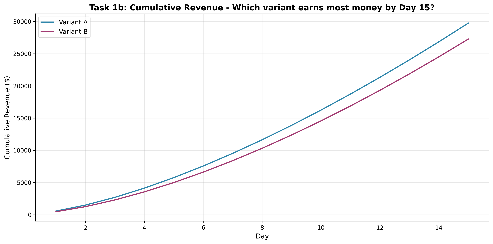

#### Task 1c: Revenue Comparison (Day 30)
**Winner: Variant A**
- Variant A: $82,761.71
- Variant B: $79,113.09
- Variant A maintains revenue advantage (4.61% higher)

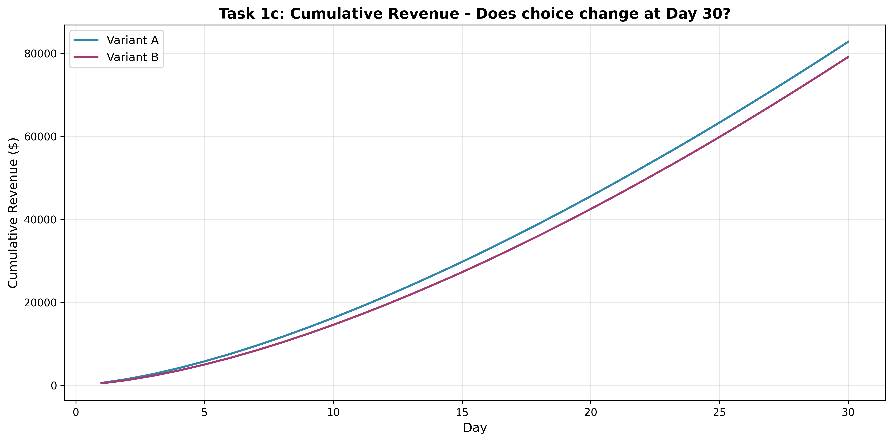

#### Task 1d: Sale Scenario Impact
**Winner: Variant A** (both normal and sale scenarios)
- 10-day sale (Day 15-24) boosts purchase rates by 1% absolutely
- Sale scenario: Variant A ($88,943.22) vs Variant B ($85,611.20)
- Winner does not change with sale campaign

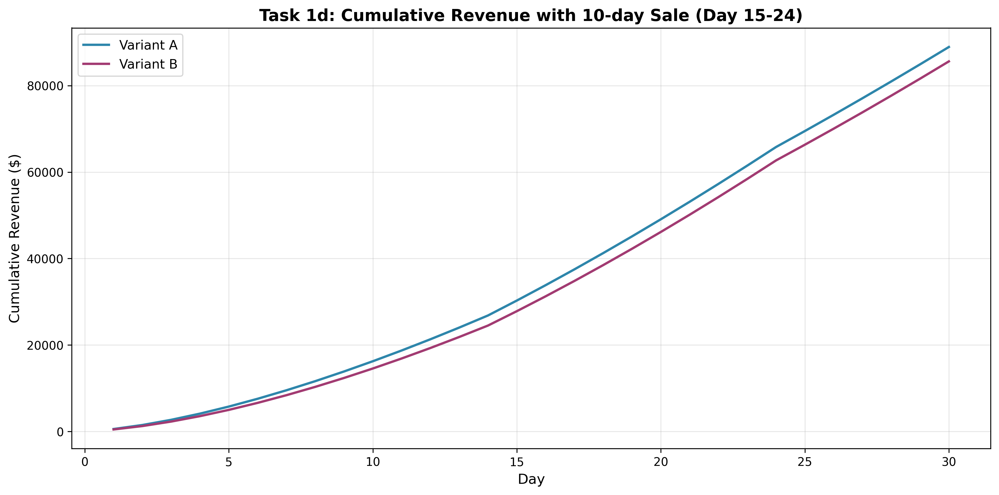

#### Task 1e: New User Source Impact
**Winner: Variant A**
- New user source added (12K old + 8K new) starting Day 20
- Variant A: $86,699.49
- Variant B: $82,291.05
- Variant A generates 5.36% more revenue

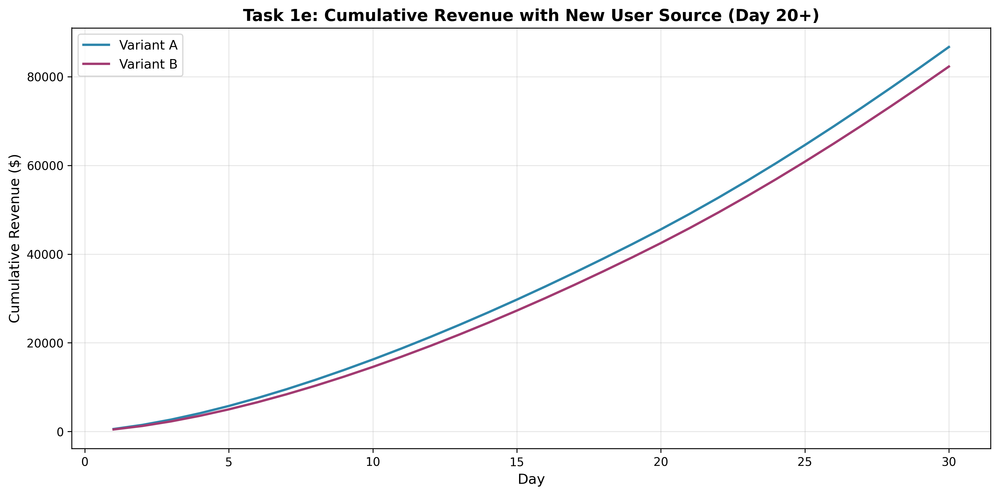

#### Task 1f: Prioritization Analysis
**Recommendation: New Permanent User Source**
- **30-day analysis**: Sale scenario produces 2.59% more revenue
- **60-day analysis**: New user source produces 5.71% more revenue ($246,901.31 vs $233,569.21)
- **Conclusion**: For long-term strategy, prioritize permanent new user source over temporary sale

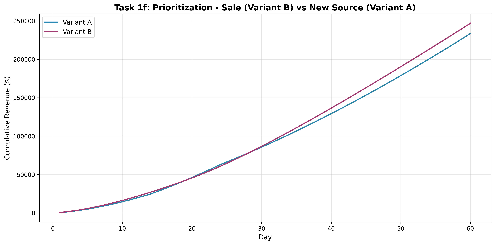

### Task 2 - Key Insights

#### First-Day Engagement Segmentation
- Users segmented into Low/Medium/High engagement tiers
- High engagement users show significantly better retention and monetization

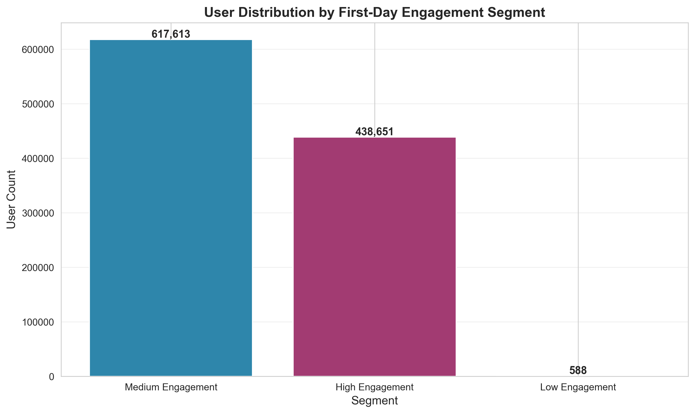

#### Session Duration Trends
- Analysis of session duration changes over time (daily and by user lifetime)
- Identifies engagement patterns as users progress

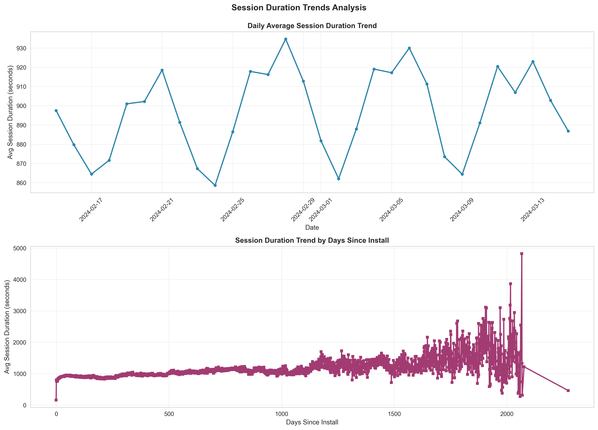

#### Match Completion Analysis
- Examines match completion rates over time
- Identifies patterns in user engagement with match mechanics

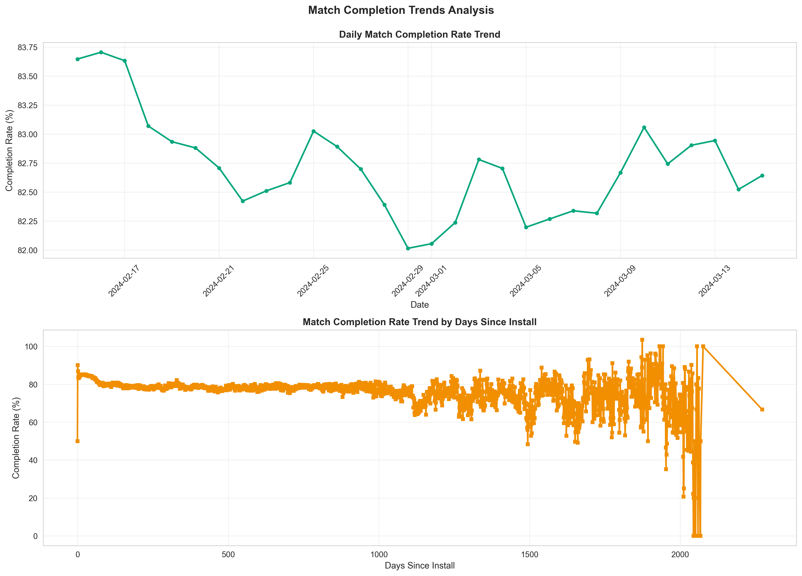

#### Win Rate Trends
- Analyzes victory rates by user lifetime (days since install)
- Reveals skill progression or difficulty curve patterns

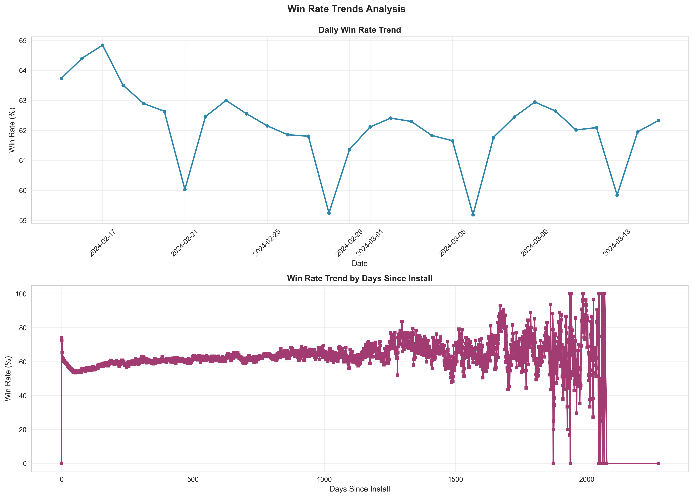

#### Monetization Segmentation
- Segments users based on spending behavior
- Correlates monetization with engagement metrics

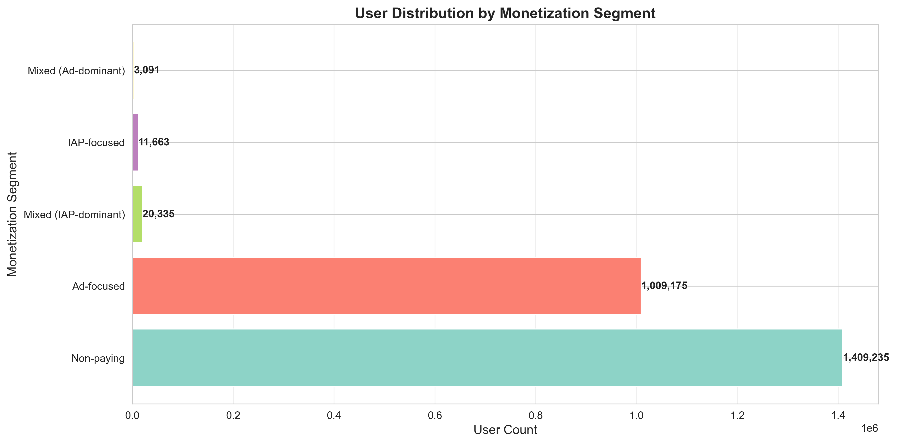

#### Platform & Country Comparison
- Compares user behavior across different platforms and countries
- Identifies regional and platform-specific patterns

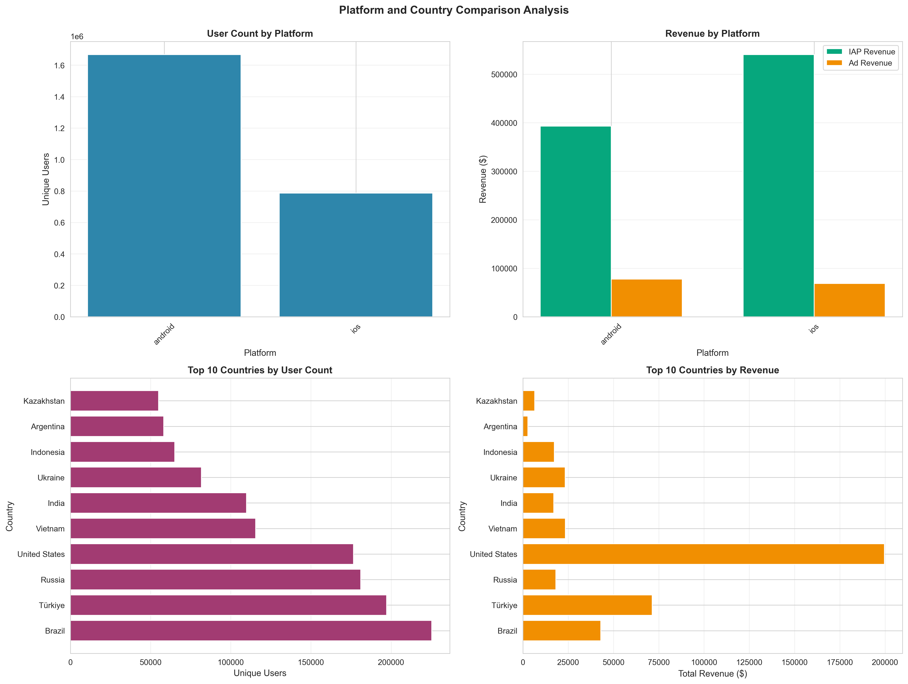

---

## Project Structure

```
Vertigo/
├── task1/
│   ├── config.py              # Variant configurations
│   ├── retention_model.py     # Power Law retention modeling
│   ├── simulation.py           # DAU and revenue calculations
│   ├── visualization.py       # Plotting functions
│   ├── run_task1.py           # Main execution script
│   └── graphs/                # Generated visualizations
├── task2/
│   ├── data_loader.py         # Dataset loading and preprocessing
│   ├── analysis.py            # EDA analysis functions
│   ├── visualization.py       # Plotting functions
│   ├── run_task2.py           # Main execution script
│   ├── dataset/               # CSV.gz data files
│   └── graphs/                # Generated visualizations
├── requirements.txt           # Python dependencies
└── README.md                  # This file
```

---

## Installation & Usage

### Prerequisites
- Python 3.8+
- Required packages: `numpy`, `scipy`, `pandas`, `matplotlib`, `seaborn`

### Setup
```bash
git clone <repository-url>
cd Vertigo
pip install -r requirements.txt
```

### Running the Analysis

**Task 1:**
```bash
cd task1
python3 run_task1.py
```

**Task 2:**
```bash
cd task2
python3 run_task2.py
```

---

## Author

-ozgur
